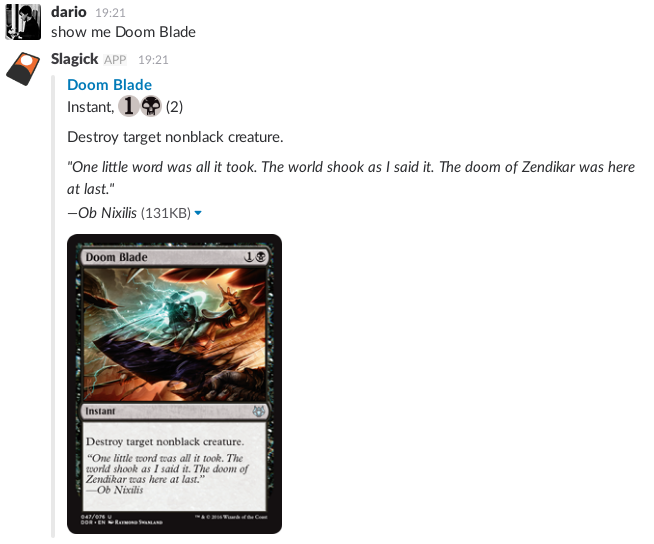
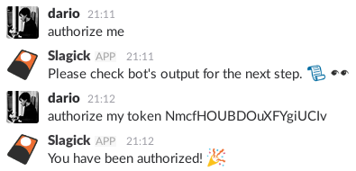

# Slagick

It's Magic: The Gathering for Slack!

## What does it do?

It will listen to channel it has been invited to for commands it knows. It currently knows these commands

You can say `show me Card Name` where _Card Name_ is the card that you want to see and it will do something like this:

It has fuzzy searching capabilities so if you're looking for "Ad Nauseum" it will still match "Ad Nauseam."

You can say `slagick authorize me` to instruct the bot to attempt to authorize you as an administrator. Only one user can be an administrator at once for the time being. In order to authorize a different user, please restart the bot.

You can say `slagick update` or `slagick update ignore cache` to trigger a database update. You should run this at least once the first time you set the bot up. The `ignore cache` version of this command can only be run by an administrator. It bypasses cache by ignoring database version checks.

You can say `slagick ping` to have the bot respond with "pong." That's all it does.

## How do I use it?

### Install dependencies

    $ go get github.com/lib/pq github.com/nlopes/slack

### Build it

    $ go build src/slagick.go

### Configure it

Before running it, you will also need to set your Slack bot API token as an environment variable.
You can put this in your `~/.bash_profile`, `~/.bashrc`, or `~/.zshrc` or just run it before executing the bot:

    $ export SLAGICK_API_TOKEN='...'

You will also need to configure the database connection and set it to the `SLAGICK_DB_CONFIG` variable.
Please see [this](https://godoc.org/github.com/lib/pq) as a reference. Example:

    $ export SLAGICK_DB_CONFIG='user=postgres dbname=postgres host=localhost port=5432 sslmode=disable'

Optionally, you can do this to avoid cluttering your environment:

    $ env SLAGICK_API_TOKEN='...' SLAGICK_DB_CONFIG='...' path/to/slagick

### Running it

You can install this binary anywhere accessible by your `$PATH` and run it like this:

    $ slagick

Or you can call it within the directory you built it in like this:

    $ ./slagick

## Docker

This project is Docker ready. You can just use this:

    $ export SLAGICK_API_TOKEN='...'
    $ export SLAGICK_DB_CONFIG='...'
    $ docker-compose up -d

It should take you from start to finish.

### Troubleshooting

On some systems, you can't access the Docker daemon without extra privileges. Use this:

    $ sudo -E docker-compose up -d

The `-E` flag is required because `sudo` will forget what environment variables you had.
